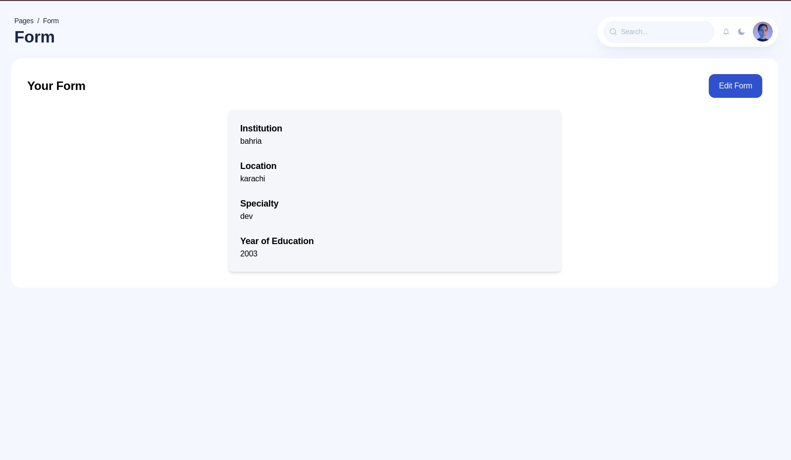
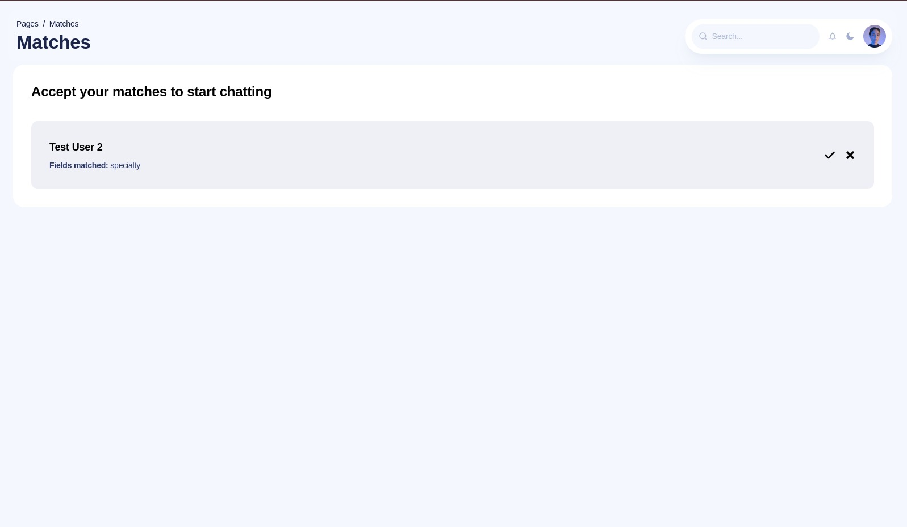
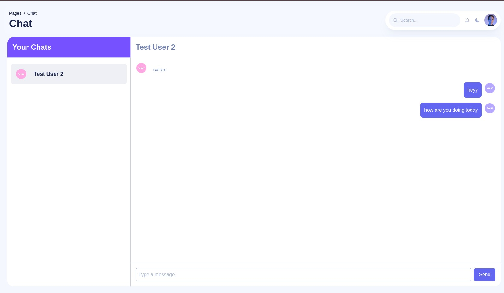

<h1 style="text-align: center;">SAAS BOILER PLATE USING NEXTJS AND SUPABASE</h1>

  
  

  
  

## FEATURES
- Authentication
- Realtime Chat
- Stripe Payment
- Suggestions
- Responsive Design
- Dark Mode

## RUN LOCAL
1. `npm install`
2. `npm run dev`

